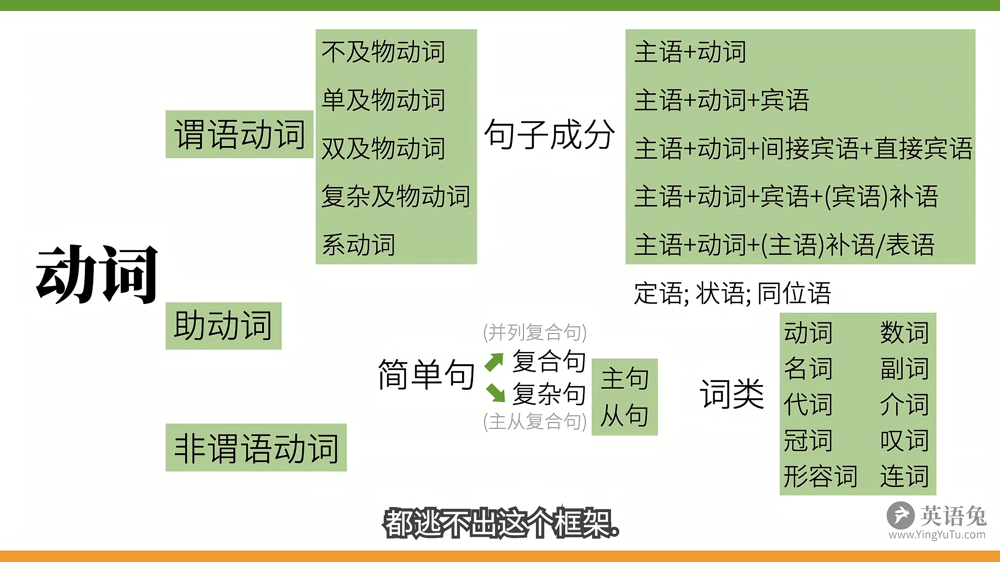

# 英语兔语法提要

[toc]

## 语法综述

### 句子结构

​		几乎所有英语句子结构都是:
​		什么+怎么样——主语(subject)+谓语(predicate)
​			                              	⬇
​		主语(人/物)+谓语(动作|动词Verbs/发生了什么事)

​		动作(动词)是谓语的核心，可以分为:

1. 可以独立完成的动作——主语+不及物动词

   Papa Rabbit <u>sleeps</u> (不及物动词 intransitive verbs)

2. 有1个动作的承受者——主语+单及物动词+宾语

   Papa Rabbit <u>likes</u>(及物动词 transitive verbs) <u>you</u>(宾语)

3. 有2个动作的承受者——主语+双及物动词+间接宾语+直接宾语

   Papa Rabbit <u>teaches</u>(双及物动词 ditransitive verbs) <u>you</u>(间接宾语) <u>English</u>(直接宾语)

   ps.teache对应的对象应该是英语，所以english是直接宾语，教谁是间接的对象

4. 只有1个动作承受者(但需要补充)——主语+复杂及物动词+宾语+(宾语)补语

   Papa Rabbit <u>consider</u>(复杂...complex-transitive verbs) <u>you</u> <u>smart</u>(object complement)

   ps.Consider和双及物动词区别在于teaches需要两个承受者，teach教谁，教什么，consider只需要一个承受者，但是需要对这个承受者做补充，这是一个什么样的承受者。

5. 非"动作"——主语+系动词 Linking Vers+(主语)补语/表语

   Papa Rabbit <u>is</u>(links verbs) <u>tall</u>. Papa Rabbit looks tall.

   tall->PapaRbbit，把高这种状态赋予Papa Rabbit.

   Papa Rabbit is in the room.

   Papa Rabbit smells nice.

   ps.系动词作用，把后面的信息赋予给主语，所以才称为Linking Verbs,连接起来两者

​		上面五种句型就是英语大多数的情况，总体来说就是在说什么+怎么样——主语+谓语。
​		其中谓语的核心就是谓语动词,  谓语动词⊆谓语

​		基本句型：

1. 无需承受者(宾语)：主语+<u>不及物动词</u>
2. 一个宾语，无补充信息：主语+<u>单及物动词</u>+*宾语*
3. 两个宾语：主语+<u>双及物动词</u>+间接*宾语*+直接*宾语*
4. 一个宾语+补充信息：主语+<u>复杂及物动词</u>+*宾语*+(宾语)**补语**
5. 赋予信息：主语+<u>系动词</u>+主语**补语**/表语

### 句子成分

​		句子成分除了上面5种例句提到的主语，谓语动词，宾语，宾语补语，表语，还有以下几种句子成分：

- 定语 Attributive——主要用来修饰主语或宾语

  <u>The little white</u> rabbit ate <u>a large</u> carrot

  the little white是主语rabbit的定语，a large是宾语carrot的定语

- 状语 Adverbial——主要用来修饰谓语动词

  The Rabbit ate <u>quickly</u>

  quickly是ate的状语.

- 同位语 Appositive —— 主要用来把主语或宾语再说一遍

  <u>Papa Rabbit</u>,<u>an English teacher</u> ,eats carrots.

  an English teacher 在这里就是把Papa Rabbit用不同的方式再说一遍

​		上面三种和最开始五种成分包含句子中会出现所有句子成分：

1. 主语 Subject
2. 谓语动词 Predicate Verb
3. 宾语 Object
4. 宾语补语 Object Complement
5. 主语补语 Subject Complement
6. 定语 Attributive
7. 状语 Adverbial
8. 同位语 Appositive

### 十大词类

​		没法拆成别的句子的称为简单句(Simple Sentence)，将简单句进行组合，形成复合句/并列句(Compound Sentences)和复杂句(Complex Sentences).

​		Compound Sentences就是句子简单的叠加，是并列关系。
​		Complex Sentences把一个句子套在另一个句子中作为某个成分，是从属关系。由1.**主句**和2.**从句**组成，从句就是把简单句修改一下来充当另一个句子的成分：

​		   简单句->{
​				[作主语=>主语从句   
​				作宾语=>宾语从句	
​				作表语=>表语从句		
​				作同位语=>同位语从句]  名词性从句

​				作定语=>定语从句
​                作状语=>状语从句
​				}

​		句子组成方式或许相同，但是句子中包含的词的类型不一定相同，比如

	主语+谓语动词+宾语
	The rabbit     ate     a carrot.
	He     saw     something over there.

​		English中词性分类有：

1. 名词 nouns ——表人和物

   Papa Rabbit is a <u>rabbit</u>.

2.  冠词 articles——英语中说明人和事物

   Papa Rabbit is <u>a</u> rabbit.

3. 代词 pronouns——替代人和物

   <u>I</u> am a rabbit.

4. 形容词 adjectives——形容人和物

   I am a <u>smart</u> rabbit.

5. 数词 numbers——表数量

   I ate <u>two</u> carrots.

6. 副词 adverbs——修饰动作或形容词，等等

   I ate two carrots <u>quickly</u>.

7. 介词 prepositions——表示和其他词关系的词

   I ate two carrots <u>with</u> chopsticks.

8. 叹词 interjections——表感叹

   <u>Ah</u>,the carrot is tasty!

9. 连词 conjunctions——连接词和句

   I ate two carrots and a potato.because I was hungry.
   
10. 动词 Verbs——表动作，做了什么

​		句子成分(5类)和句子中的词类关系：**句子成分中除了谓语动词是动词，其余所有成分都可能包含不同的词类**

### 谓语动词

​		谓语动词有三种状态(Tense时 Aspect体 Mood气)表示：

1. 动作时间

   现在，过去，将来，过去将来

2. 动作状态

   一般，完成，进行，完成进行

3. 动作假设，情感...（语法的语气）

   虚拟语气：If I were a rabbit...

   陈述语气：I ate a carrot and...

   祈始语气：Eat this carrot and...

###  助动词

​		谓语动词本身无法独自完成上述的功能，比如表否定，可能，必须性等，需要助动词 auxiliary verbs 来一起完成。

​		比如eat 吃：

- (协助)表示"吃过了(完成)"=> have => have eate
- (协助)表示"正在吃(进行)"=> be      => is eating
- (协助)表示"被吃"               => be       => is eaten
- (协助)表示"有能力吃"       => can     => can eat
- (协助)表示"有可能吃"       => might => might eat
- (协助)表示"有义务吃"       => must   => must eat
- (协助)表示"不吃(否定)"     => do       => do not eat

​		但是有的助动词除了帮助谓语动词完成状态作用，还有表达实义的功能，比如：

- can=>易拉罐
- might=>力量
- must=>发霉的
- do=>做某事
- have=>拥有
- be=>存在

​		PS.**不要把助动词的作用和它表达的实义混肴**

### 非谓语动词

​		非谓语动词可以作除了谓语动词的其余句子成分，可以取代所有句子的从句，但是不再具有表示动作时间，状态，语态，语气的功能。

​		非谓语动词：1.动词不定式 2.现在分词 3.动名词 4.过去分词

### 总结

​		我们上面说了这么多都是围绕动词，动词就是英语语法的核心，几乎能串起所有的语法概念。

