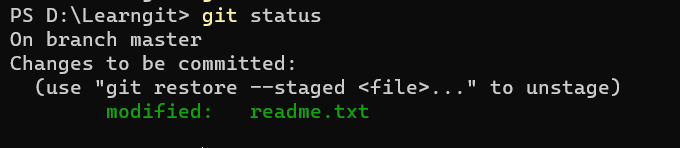
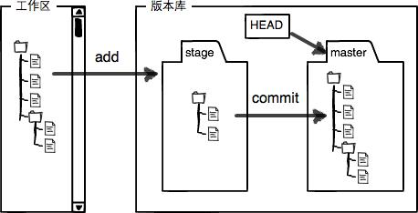

# Git语法
[toc]

​		Git是分布式版本控制系统，只能追踪文本文件的变更。所有需要记录的变更文件都必须在版本仓库中。

1.设置git仓库: git init

2.添加文件到仓库：git add readme.txt
	一次添加多个文件：git add -A .    提交所有被修改的文件，包括新建文件到暂存区

3.提交文件：git commit -m "write a txt"
	跳过暂存区，直接把工作区变更提交 git commit -am

## 版本控制

1.查看当前文件状态：git status



2.查看修改：git diff

3.Git中，使用HEAD指针指向当前版本，跳转到以前的或者现在版本可以使用：

- git reset HEAD^——跳转到前一个版本
- git reset HEAD~3——跳转到前3个版本
- git reset 1ab3...——跳转到指定版本

git log：Git会为每次提交记录生成独一无二的哈希值，可以使用git log命令查看过往的提交版本。
git log --pretty=oneline——简化输出

git reflog：查看执行的历史命令

### Git暂存区

​		在git init的目录下(工作区)，有一个.git文件夹，这是git仓库的版本库，用于标识git工作的内容。版本库里面分为暂存区和分支。

​		git add就是把工作区更改的文件提交到暂存区，git commit把暂存区的文件提交到正在使用的分支上。把工作区做的变更，在.git里面记录下来，这样就是git的工作原理。




4.撤销文件变更

git restore \<file\>  ——撤销工作区的变更
git restore --staged \<file\> ——撤销暂存区的变更

git rm \<file\> 删除文件，并把此次变更提交到暂存区
撤销删除，可以使用git restore --staged \<file\>

## 远程仓库

​		个人用户使用github作为远程仓库，公司内部可能使用gitlab来搭建远程仓库。

### 建立远程仓库

1.github上新建一个仓库

2.`ssh-keygen -t rsa -C "email@example.com"`  生成公私钥

3.把生成的私钥放到github账户中。

存在的问题：

- 存在几个不通主机的密钥文件

  config文件设置:

  ```shell
  Host github
      User git  
      HostName github.com
      PreferredAuthentications publickey
      IdentityFile "C:\Users\xxx\.ssh\git_rsa"
      ServerAliveInterval 300
      ServerAliveCountMax 10
  ```

- ssh-add \<rsafile\>

- ssh报错：Error connecting to agent

  ssh未启动，需要去服务上启动，找到Openssh服务，改禁用为手动或者自动

  然后 ssh-agent 启动ssh服务

但是我搞了半天还是github push时候会权限拒绝，只有ssh key命名为id_rsa才行，不知道什么原因。😍

**4.推送远程仓库**

建议本地仓库与远程仓库的连接:
git remote add origin git@github.com:xxx/xxx.git 

git push -u origin master

5.删除远程仓库

git remote rm \<name\>

删除远程仓库前使用 git remote -v 查看远程信息

### 分支与管理

### 创建与合并分支

1.查看分支：git branch

2.创建分支：git branch \<name\>  

3.创建且切换分支：git checkout -b \<name\>   git switch -c \<name\>

4.切换分支：git switch \<name\>

5.合并指定分支到当前分支：git merge \<name\>

6.删除分支：git branch -d \<name\>

当前分支与别的分支合并时(git merge ) ，如果另外一分支在同一行内容上有冲突，需要先消除冲突，才能完成合并。

7.默认合并分支时会使用fast forward模式，删除分支后不可恢复，添加 --no-ff参数，保留删除记录
git merge --no-ff -m "merge with"


### Bug分支

​	 	在开发过程中，发现bug，可以通过一个临时的Bug分支修复，修复后再合并。

1.保存分支修改进程：git stash

2.切换到master并新建一条bug分支进行修复：git switch master; git switch -c bug-01;

3.修改完后在master合并：git merge bug-01

4.在开发分支同步Bug修复工作：

- 查看保存的工作现场：git stash list
- 恢复工作现场并删除之前的工作现场缓存：git  stash pop
- 复制Bug修复提交到当前分支：git cherry-pick 5a8c6s2

### 多人协作

​		1.将共同的开发版本放在公共平台(比如：github)，各个开发者git clone到本地进行开发，默认情况下，能够看到master分支。

​		2.新建一条dev分支开发，开发完成后，git push origin master 推送到远程分支

​		3.如果存在冲突，先把平台上最新的内容clone下来，在本地解决冲突后再push


## 标签管理

​		每次提交git会有hash值作标记，不利于人去查看每次提交的内容，可以为每次提交打上标签tag，方便查看。

1.git tag \<tag name\>——新建标签，默认指向HEAD

2.git tag \<tag name\> \<commit id\>  为指定commit打标签

3.git tag 查看所有标签

4.git show \<tag name\> 查看标签提交的内容


**标签操作**

1.删除标签：git tag -d v0.1

2.推送标签：git push origin v1.0或者 git push origin --tags（推送全部标签）

3.删除远程标签：a.先删除本地标签。b.再git push origin :refs/tags/v0.1


